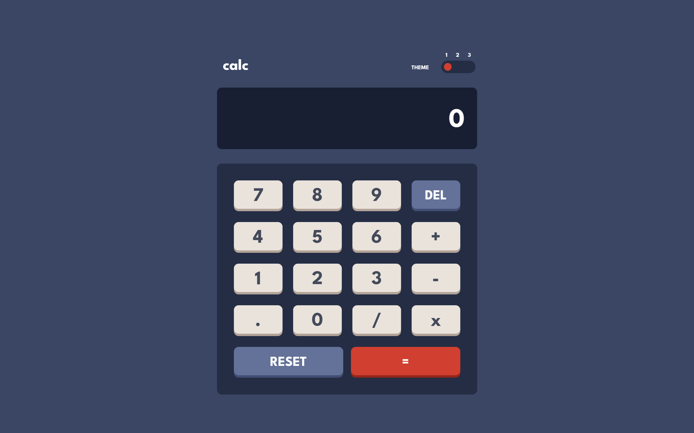
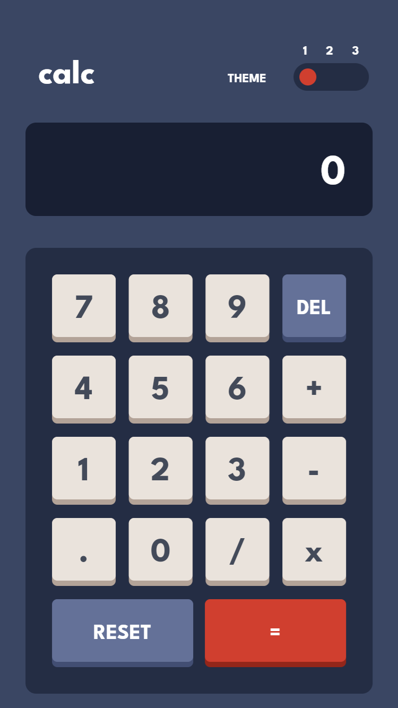

# Frontend Mentor - Calculator app solution

This is a solution to the [Calculator app challenge on Frontend Mentor](https://www.frontendmentor.io/challenges/calculator-app-9lteq5N29). Frontend Mentor challenges help you improve your coding skills by building realistic projects. 

## Table of contents

- [Overview](#overview)
  - [The challenge](#the-challenge)
  - [Screenshot](#screenshot)
  - [Links](#links)
- [My process](#my-process)
  - [Built with](#built-with)
  - [What I learned](#what-i-learned)
  - [Continued development](#continued-development)
  - [Useful resources](#useful-resources)
- [Author](#author)

## Overview

### The challenge

Users should be able to:

- See the size of the elements adjust based on their device's screen size
- Perform mathmatical operations like addition, subtraction, multiplication, and division
- Adjust the color theme based on their preference
- **Bonus**: Have their initial theme preference checked using `prefers-color-scheme` and have any additional changes saved in the browser

### Screenshot

### Links

- Solution URL: [Add solution URL here](https://your-solution-url.com)
- Live Site URL: [Add live site URL here](https://your-live-site-url.com)

## My process

### Built with

- [Flutter](https://flutter.dev/) - Multi-platform framework
- [Dart](https://dart.dev/) - Programming language

### What I learned

With this project I learned a lot, I never used flutter before and I really like it. It's kinda similar to HTML structure, the widgets make easy the development, the thing that I like is that you only make one app and it works everywhere.

### Continued development

I'd like to continue learning about flutter, I found really interesting the way it works, but, I think I can get more knowledge to make even better apps.

### Useful resources

- [Basics of flutter](https://www.youtube.com/watch?v=1xipg02Wu8s) - This video help me to learn the basics of flutter.
- [State managment](https://www.youtube.com/watch?v=3tm-R7ymwhc) - One of the things that take more time to learn was the state managment, this video is good for understand the basics.
- [Layout](https://www.youtube.com/watch?v=u0e2L5yoxFI) - With this I understand how the layout works compared to css.
- [Provider plugin](https://www.youtube.com/watch?v=uQuxrZE2dqA) - I found pretty difficult to manage state within widgets, so I found this plugin that make a lot easier to do that.

## Author

- Frontend Mentor - [@magnuslonngi](https://www.frontendmentor.io/profile/magnuslonngi)
